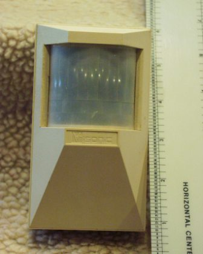
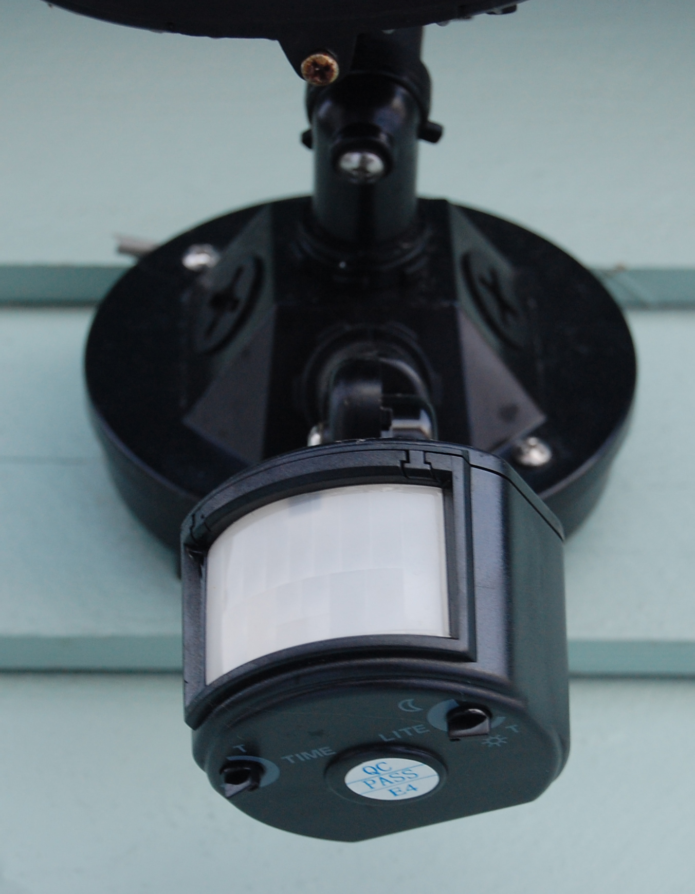
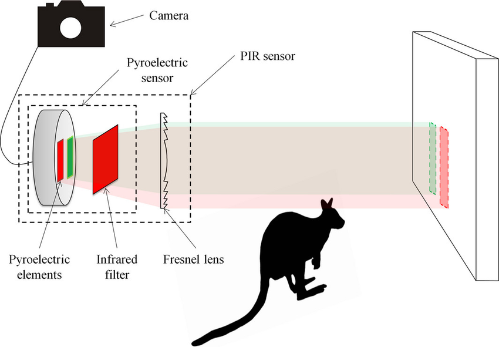
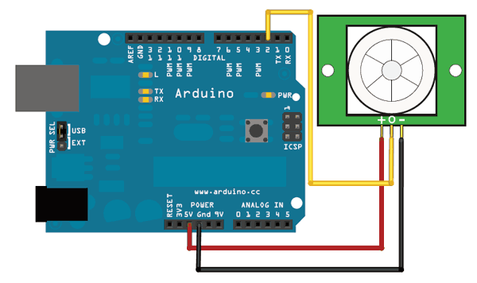
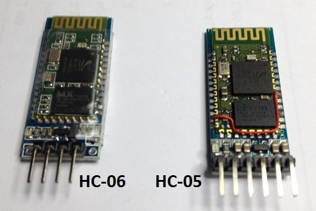
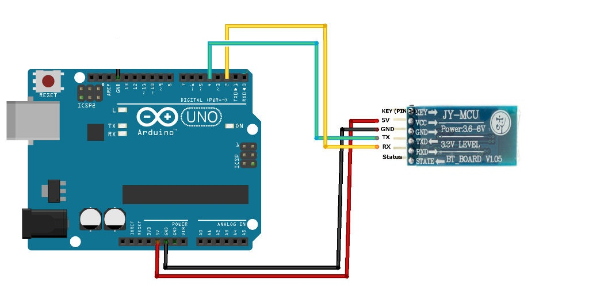
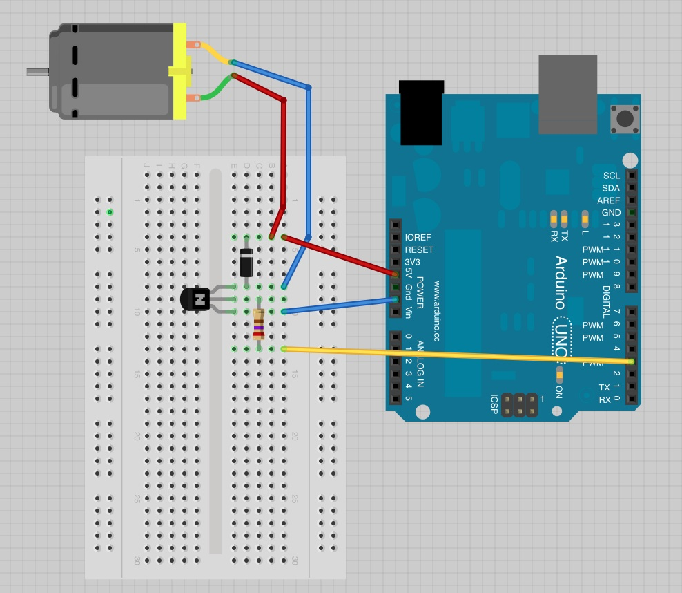
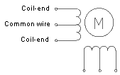
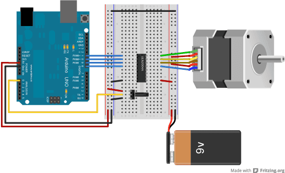
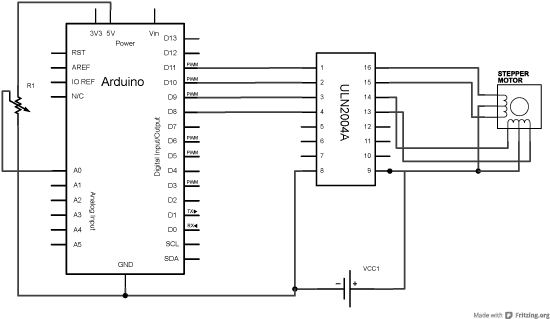

<!-- Copyright (c) 2022 Tobias Briones. All rights reserved. -->
<!-- SPDX-License-Identifier: CC-BY-SA-4.0 -->
<!-- This file is part of https://github.com/tobiasbriones/cp-unah-is911-microprocessors -->

# Arduino Sensors and Motors

This is a research article that presents a collection of documentation and code
examples as a theoretical framework for different infrared sensors, for
Bluetooth connection and for direct current motors applied to the Arduino board.

## Introduction

When learning the Arduino platform in overall there are many possibilities to
explore and some of them are sensors, external modules that attach to the
Arduino board like a Bluetooth module for wireless connectivity, and actuators
like direct current motors including stepper motors. These are some basic
devices to start getting utility out of Arduino board applications.

Here you can identify the needs to use inputs, outputs, power control by PWM,
response times, wireless control of devices, coupling of external devices and
others that are widely applied to daily life in mobile or security devices or
even industrial applications for heavier power control but with similar designs.

## Objective

The objective of this research is to collect a theoretical framework on basic
sensors and motors that work with Arduino.

### Specific Objectives

Find out the general operation and example programs for Arduino of:

- PIR sensors.
- IR sensors.
- Bluetooth HC-06 module.
- Control of DC motors.
- Unipolar stepper motor.

## PIR/IR Sensors

**PIR sensors** are **passive IR sensors**. IR stands for infrared and IRs can
simply emit infrared light while PIRs are passive and only detect it.
The "P" in PIR means passive since, as said, they do not emit energy. The
most useful applications for these sensors include detecting any object,
person, or animal that has a temperature of more than $$5K$$ since these emit
infrared light that the human being does not detect but the device does [1],
and therefore it's possible to know if something or someone passes or moves
by measuring a differential change in the sensor given the energy of what
approaches the sensor. All this is used for security applications for example.

According to Wikipedia, PIR sensors:

> A **passive infrared sensor (PIR sensor)** is an electronic sensor that
> measures infrared (IR) light radiating from objects in its field of view. They
> are most often used in PIR-based motion detectors. PIR sensors are commonly
> used in security alarms and automatic lighting applications.
>
> Source: *Wikipedia* \| Passive infrared sensor (under CC-BY-SA-3.0)



<figcaption>
<p align="center"><strong>House PIR</strong></p>
<p align="center">Source: Wikipedia | Passive infrared sensor. By Jack LaRosa -
Photographed and uploaded by me., Public Domain,
https://commons.wikimedia.org/w/index.php?curid=4479143.</p>
</figcaption>



<figcaption>
<p align="center"><strong>PIR Motion Detection</strong></p>
<p align="center">Source: Wikipedia | Passive infrared sensor. By CHG - Own work, Public
Domain, https://commons.wikimedia.org/w/index.php?curid=6087132.</p>
</figcaption>

As you can see, PIR sensors are used for motion detection in houses, this can
detect thieves, animals, etc. The place for the installation of these devices
must be taken into account to avoid false positives, for example, preventing the
sensor from detecting the outside environment through a window.

PIR sensors work by detecting a change in temperature that they sense
internally. These cannot measure the temperature but the change that occurs when
an object passes through the sensor. There are two sensors sensitive to infrared
light internally that detect the temperature of the environment and when a hot
object passes through the sensor, that temperature is detected by one of the
plates or sensors and these two signals are the input of a differential
amplifier [^1] which produces the shift signal either a positive shift if the
hotter object is passing by or negative if it is leaving. When there are no 
nearby hot bodies, the signals cancel [2,3].

[^1]: An op amp can be said to be a more sensitive differential amplifier with
    more gain.

The following figure explains how a PIR works:



<figcaption>
<p align="center"><strong>PIR Trigger Consists of a Pyroelectric Sensor and Fresnel Lens</strong></p>
<p align="center">Source: Research Gate | How do passive infrared triggered camera traps
operate and why does it matter? Breaking down common misconceptions.
Licensed under the Creative Commons Attribution-NonCommercial 4.0
International.</p>
</figcaption>

The Fresnel lens can be used to collect light more punctually and the rest of
the operation is as described above.

### PIR Sensor in Arduino

This Arduino program demonstrates how to use the PIR sensor to detect nearby
objects. The PIR sensor simply acts as a digital input to establish whether
there is an object in the sensor's viewing area.

```c
/*
* PIR sensor tester
* by Adafruit Learning System
*/

int ledPin = 13;
int inputPin = 2;
int pirState = LOW;
int val = 0;

void setup()
{
    pinMode(ledPin, OUTPUT);
    pinMode(inputPin, INPUT);
    Serial.begin(9600);
}

void loop()
{
    val = digitalRead(inputPin);
    if (val == HIGH)
    {
        digitalWrite(ledPin, HIGH);
        if (pirState == LOW)
        {
            Serial.println("Motion detected!");
            pirState = HIGH;
        }
    }
    else
    {
        digitalWrite(ledPin, LOW);
        if (pirState == HIGH)
        {
            Serial.println("Motion ended!");
            pirState = LOW;
        }
    }
}
```

<figcaption>
<p align="center"><strong>PIR Sensor in Arduino</strong></p>
<p align="center">Source: <it>Adafruit Learning System</it> | PIR
Motion Sensor [4]</p>
</figcaption>

Simply define the output of the LED at Arduino's pin $$13$$ and the 
input of the sensor at PIN $$2$$. There's a state variable `pirState` to 
debug the current value of the sensor by `Serial`. The variable `val` stores
the digital value of the sensor.

The circuit diagram is simply:



<figcaption>
<p align="center"><strong>Proximity PIR Arduino Circuit</strong></p>
<p align="center">Source: <it>Adafruit Learning System</it> | Using a PIR w/Arduino. 
Converted from GIF to PNG. By lady ada. Licensed under the 
Attribution-ShareAlike Creative Commons License.
</p>
</figcaption>

Which consists of feeding the sensor and connecting the output of the sensor to
Arduino's input $$2$$. Remember to also connect the LED to Arduino's $$13$$
terminal.

### IR Sensors

Active IR sensors act as proximity sensors by having LED light emission,
noticing the principle that light can come out and be reflected by the 
"intruder" object and be able to measure latency. Basically that's the 
difference from PIRs.

## Bluetooth HC-06 Module

With Bluetooth connectivity you can take greater control over the applications
on Arduino by being able to pass control to mobile devices such as smartphones.
There are two popular modules, the HC-06 and the HC-05, which differ mainly in
software and functionality in that the HC-06 only works as a slave while the
HC-05 can be slave or master. This means that a connection from a slave can
only connect to a master while a master module does not have this
limitation. When connecting a Bluetooth device, this has a unique address of
$$48bit$$ and a name to be identified [5].



<figcaption>
<p align="center"><strong>BT HC-06 vs HC-05</strong></p>
<p align="center">Source: <it>www.prometec.net</it> | MODULO BLUETOOTH HC-06. Under fair
use [5].
</p>
</figcaption>

### Program that Reads and Writes via Bluetooth

The following program uses the `SoftwareSerial` library to establish the
connection to the HC-06 Bluetooth module via `Serial` and as specified at a data
rate of $$9,600\, baud$$ which must be correctly configured. Remember that the
Arduino terminals $$0$$ and $$1$$ are intended for serial communication with the
computer according to previous articles, so other terminals will be used for the
Bluetooth module instead.

```c
// By https://www.prometec.net/bt-hc06/

#include <SoftwareSerial.h>

SoftwareSerial BT1(4,2);

void setup()
{
    Serial.begin(9600);
    Serial.println("Enter AT commands:");
    BT1.begin(9600);
}

void loop()
{
    if (BT1.available())
    {
        Serial.write(BT1.read());
    }
    if (Serial.available())
    {
        String str = getLine();
        BT1.print(str);
        Serial.println("---> " + str);
    }
}

String getLine()
{
    String S = "" ;
    if (Serial.available())
    {
        char c = Serial.read();
        while (c != '\n')
        {
            S = S + c;
            delay(25);
            c = Serial.read();
        }
        return(S + '\n');
    }
}
```

<figcaption>
<p align="center"><strong>Program that Reads and Writes via Bluetooth</strong></p>
<p align="center">Source: <it>www.prometec.net</it> | MODULO BLUETOOTH HC-06. Under fair
use [5].
</p>
</figcaption>

As explained, the `SoftwareSerial` library is imported to create a `BT1` object
which gives us the API to communicate with the Bluetooth device. Likewise, the
Arduino serial is used to communicate with the computer. In the loop, it can be
seen that when there is data from the bluetooth device, it's read and printed
by the serial, and if there is data waiting in the serial, then a line of text
is requested to be entered to later send it through the Bluetooth device.

To read the line of text from serial, the string is concatenated by inputting
`Serial.read()` until a new line or "enter" is entered on the computer.

The circuit is trivial and is depicted below.



<figcaption>
<p align="center"><strong>BT Arduino Circuit</strong></p>
<p align="center">Source: <it>www.prometec.net</it> | MODULO BLUETOOTH HC-06. Under fair
use [5].
</p>
</figcaption>

To test the other part of the system, a smartphone with some application such as
Bluetooth SPP Manager can be used to establish communication with the HC-06
Bluetooth module.

## DC Motor

Direct current motors were among the first to be widely used and transform
electrical energy into mechanical energy. Its operation is related to torque,
coils and electromagnetism.

### DC Motor Control with PWM

The motor will be controlled by analog output with PWM. Remember that PWN
modulates the signal that is sent to control the power delivered by varying the
width of the square or digital wave which averages the voltage delivered in each
cycle so that the power — that is proportional to the voltage — is eventually
controlled.

The code is the following:

```c
/*
Adafruit Arduino - Lesson 13. DC Motor
*/

int motorPin = 3;

void setup()
{
    pinMode(motorPin, OUTPUT);
    Serial.begin(9600);
    while (!Serial);
    Serial.println("Speed 0 to 255");
}

void loop()
{
    if (Serial.available())
    {
        int speed = Serial.parseInt();
    }
    if (speed >= 0 && speed <= 255)
    {
        analogWrite(motorPin, speed);
    }
}
```

<figcaption>
<p align="center"><strong>DC Motor Control with PWM</strong></p>
<p align="center">Source: <it> Adafruit Learning System</it> | Arduino Lesson
13. DC Motors. Under fair use. [6]
</p>
</figcaption>

The terminal for the motor is defined as $$3$$ in output mode. The loop 
reads the value in $$[0, 255]$$ from the `Serial` to control the speed of the 
motor. This value is written using PWM and the `analogWrite` method.

The diagram contains some aspects to take into account:



<figcaption>
<p align="center"><strong>DC Motor Arduino Circuit</strong></p>
<p align="center">Source: <it> Adafruit Learning System</it> | Arduino Lesson 13. DC Motors. By
Simon Monk. Licensed under the Attribution Creative Commons License/ 
</p>
</figcaption>

We can see here we need:

- $$1$$ DC Motor $$6V$$.
- $$1$$ Transistor $$PN2222$$.
- $$1$$ Diode $$1N4001$.
- $$1$$ Resistor $$270\ohm$$.
- Arduino Board.
- Others like cable.

The transistor acts as a switch to control the motor with the signal it receives
at its base from the Arduino pin and to the collector that connects to the motor
through the diode and the emitter that goes to ground. Note that, as usual when
studying electronics, we put a diode when there are inductive devices such as
coils or motors to avoid a discharge with current in the opposite direction
towards our circuit or incorrect polarizations. Also, the motor obviously draws
a lot of current so the Arduino can't handle it, and a simple transistor is used
for power control.

### Unipolar Stepper Motor

Stepper motors are DC motors that rotate a specific amount each time they
receive a pulse. This pulse can be a square wave. There are two types of
two-phase stepper motors according to the arrangement of their coils: unipolar
and bipolar [7].

Unipolar motors have one center winding per phase which allows the polarity to
be easily changed without changing the center winding.



<figcaption>
<p align="center"><strong>Unipolar Stepper Motor Windings</strong></p>
<p align="center">Source: <it>Wikipedia</it> | Stepper motor. By Yegorius - Own work, CC BY-SA
4.0, https://commons.wikimedia.org/w/index.php?curid=3845597.
</p>
</figcaption>

However, bipolar motors have a single winding per phase.

#### Configuration of a Stepper Motor in Arduino

The circuit is the following:



<figcaption>
<p align="center"><strong>Unipolar Knob Circuit</strong></p>
<p align="center">Source: <it>Arduino Docs</it> | Arduino and Stepper Motor Configurations. By
Arduino. Licensed under the Creative Commons Attribution Share Alike
4.0 International License.
</p>
</figcaption>

To make it clearer, the schematic is given below:



<figcaption>
<p align="center"><strong>Unipolar Knob Schematic</strong></p>
<p align="center">Source: <it>Arduino Docs</it> | Arduino and Stepper Motor Configurations. By
Arduino. Licensed under the Creative Commons Attribution Share Alike
4.0 International License.
</p>
</figcaption>

You basically need a U2004 Darlington Array [^2], a unipolar stepper motor, a
potentiometer, and the Arduino board. Pins $$8-11$$, control the motor.

[^2]: ULN2004s are high-voltage, high-current Darlington arrays, each containing
    seven open-collector Darlington pairs with common emitters. Each channel is
    rated for $$500 mA$$ and can handle maximum currents of $$600 mA$$. Source: 
    grobotronics.com \| Darlington Array ULN2004 [8].

The code will control the motor via the analog input of the potentiometer, and
it works for unipolar and bipolar motors (but the given circuit is for 
unipolar).

```c
// By https://docs.arduino.cc/learn/electronics/stepper-motors

#include <Stepper.h>

#define STEPS 100

Stepper stepper(STEPS, 8, 9, 10, 11);
int previous = 0;

void setup()
{
    stepper.setSpeed(30);
}

void loop()
{
    int val = analogRead(0);

    stepper.step(val - previous);
    previous = val;
}
```

<figcaption>
<p align="center"><strong>Program to Control Unipolar/Bipolar Stepper 
Motor with Potentiometer</strong></p>
<p align="center">Source: <it>Arduino Docs</it> | 
https://docs.arduino.cc/learn/electronics/stepper-motors [9]
</p>
</figcaption>

The `Stepper` library is imported to create an object of the `Stepper` class and
the number of steps is defined according to the engine. For the `Stepper` object
it builds by passing the steps and the pins where the motor is connected. In the
`setup` the motor speed is set to $$30RPM$$. In the `loop` the value of the
potentiometer is read and the difference in reading is calculated with respect
to the previous one in order to move the motor with that difference.
