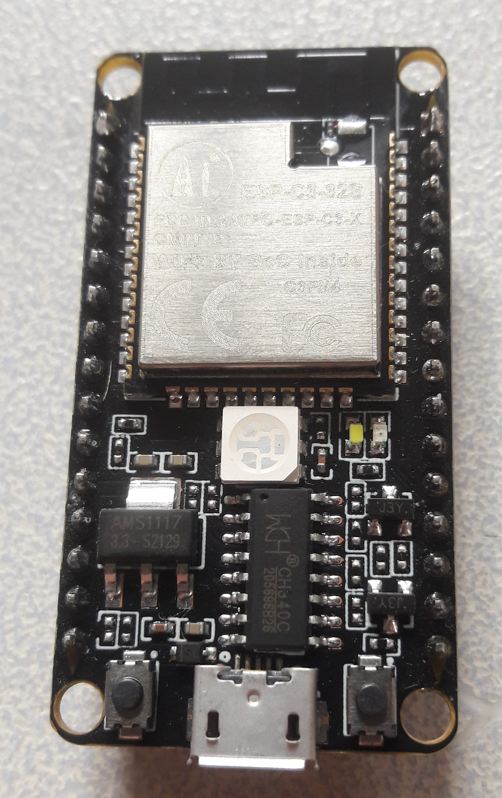
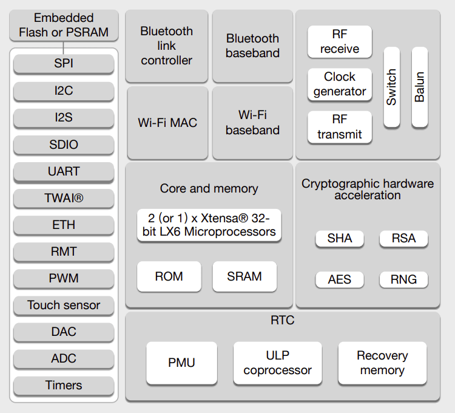
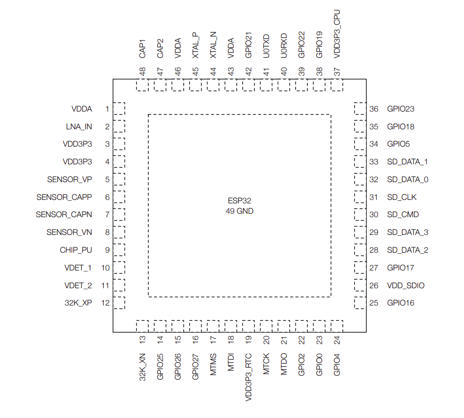
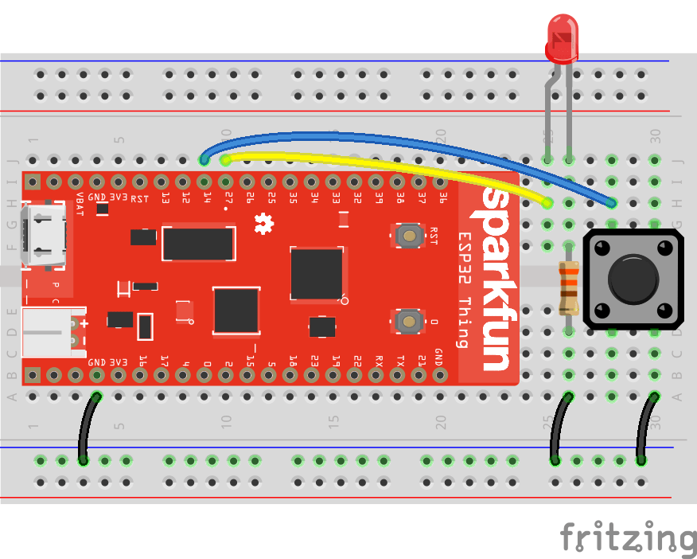
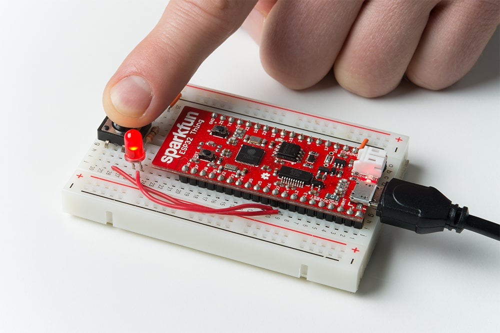

<!-- Copyright (c) 2022 Tobias Briones. All rights reserved. -->
<!-- SPDX-License-Identifier: CC-BY-SA-4.0 -->
<!-- This file is part of https://github.com/tobiasbriones/cp-unah-is911-microprocessors -->

# ESP32 with CPP and MicroPython

In this theoretical framework the entry information to start using the ESP32
microcontroller board is investigated as well as example programs in C++ with 
Arduino IDE and MicroPython.

## Introduction

ESP32 is a low-cost microcontroller board [1] similar to the other boards 
known as Arduino and Raspberry Pi Pico. It can be programmed using Arduino
IDE when setting up the corresponding configuration and also using
MicroPython too. It has a lot of features similar to those of this type of
entry microcontroller boards.

The ESP32 board has a great capacity for wireless connection both Wi-Fi as 
Bluetooth, has great integrations in its design, under power consumption and
robust design [2]. Therefore, we have the following product description:

> A feature-rich MCU with integrated Wi-Fi and Bluetooth connectivity for a
> wide-range of applications.
> 
> Source: ESP32 Wi-Fi & Bluetooth MCU \| *Espressif Systems* [2] (under fair 
> use)

ESP32 is $$2.4GHz$$ integrated Wi-Fi and Bluetooth chip with the $$40nm$$ 
ultra-low power TSMC technology, achieving the best power and performance of
connectivity or radio frequency, as well as other attributes such as:
robustness, versatility, and reliability. Designed to be a mobile IoT device 
with features specific with the state-of-the-art in this regard [3].

In the following image you can see an ESP32 board mounted on the NodeMCU board 
[^1].

[^1]: A NodeMCU card is a low-cost IoT platform and open source that runs ESP
    cards like the ESP32 [4]



<figcaption>
<p align="center"><strong>ESP32 Board</strong></p>
<p align="center">Source: ESP32 | <it>Wikipedia</it>.
By Popolon - Own work, CC BY-SA 4.0,
https://commons.wikimedia.org/w/index.php?curid=112634884.
</p>
</figcaption>

### Features

Full specifications for the ESP32 card can be found on the official
[spec sheet](https://www.espressif.com/sites/default/files/documentation/esp32_datasheet_en.pdf)
so the most notable features of the product will just be listed below [3]:

- Wi-Fi 802.11 b/g/n, 802.11 n ($$2.4GHz$$) upto $$150Mbps$$, ant diversity, 
  etc.
- Bluetooth v4.2 BR/EDR y LE, transmissor class-1, class-2, class-3 without 
  external power amplifier, power control, +9 dBm transmission, etc.
- CPU Xtensa single-/dual-core $$32 bit$$ LX6.
- $$448 KB$$ ROM.
- $$520 KB$$ SRAM.
- $$16 KB$$ SRAM in RTC.
- Internal oscillator with calibration of $$8 MHz$$.
- Internal RC oscillator with calibration.
- An RTC timer, etc.
- $$34$$ programmable GPIO.
- Secure boot, encryption though flash, AES/SHA-2/RSA/ECC/RNG algorithms.
- Large number of applications such as cameras for video streaming, robots 
  for agriculture, image recognition, etc.

The features are undoubtedly very interesting and complete. Regarding the 
applications that can be given to this microcontroller, there are many.

The following block diagram shows the architecture of this board where the 
main characteristics stand out:



<figcaption>
<p align="center"><strong>ESP32 Functional Block Diagram</strong></p>
<p align="center">Source: ESP32 Datasheet | <it>ESPRESSIF</it> [3] (under 
fair use)
</p>
</figcaption>

Or also this other one which shares a lot of similarity:


<figcaption>
<p align="center"><strong>Espressif ESP32 Chip Function Block Diagram 
(optional figure)
</strong></p>
<p align="center">Source: ESP32 | <it>Wikipedia</it>. By Brian Krent (talk · contribs) - Own work,
CC0, https://commons.wikimedia.org/w/index.php?curid=72304119.
</p>
</figcaption>

In order to use the device, it is important to know its disposition of pins,
this is obtained from the following official documentation:



<figcaption>
<p align="center"><strong>ESP32 Pin Layout</strong></p>
<p align="center">Source: ESP32 Datasheet | <it>ESPRESSIF</it> [3] (under 
fair use)
</p>
</figcaption>

Finally, in [http://esp32.net](http://esp32.net) you will also find features and
specifications, development resources for many programming languages and 
platforms, online communities about this specific device, readings and videos,
hardware platforms, information about vendors who sell this device and other
accessories [5].

## Development in Arduino IDE and C++

This section will try to address how to create a program for the ESP32 board 
using Arduino IDE and C++. In the next section, you will see how the process is
in MicoPython.

What needs to be done to set this configuration is the following [6]:

- Download and install Arduino IDE.
- Go to File / Preferences / Additional Boards Manager URLs and enter the 
  official address to install the ESP32 board [https://dl.espressif.com/dl/package_esp32_index.json](https://dl.espressif.com/dl/package_esp32_index.json).
- Go to Tools / Board / Boards manager.
- Select the ESP32 board now that has been added to the repository with the 
  previous step, and proceed to install it.
- Select the board you have from all the possible options.
- Select the ESP32 USB port when connecting the ESP module.

The esptool tool will be used to create the firmware and flash it on the ESP32
board.

The board can be decoupled, that is, only the chip, or in a NodeMCU card as
illustrated above. Using Arduino IDE to flash this card is more complicated 
as it takes several more steps. Of course, it's Arduino IDE and not ESP32 
IDE (that's why it's harder). 

For this, you have to reset the microcontroller and start it in flash mode using
GPIO-0 to Ground. Also take into account about the programmer to be used as
mentioned at the beginning. Lastly, for a more visual and in-depth look at this
process can be consulted
[ESP32 - Program a ESP32 \| Studio Pieters](https://www.studiopieters.nl/esp32-program-a-esp32)
[6], as well as this other higher quality guide
[How to Program ESP32 with Arduino IDE?](https://www.electronicshub.org/esp32-arduino-ide)
[7].

### Program

The following program can be used for the ESP32. It's the same as C++ for
Arduino, and is self-explanatory.

```c
#define ledPin 2

void setup()
{
    pinMode(ledPin, OUTPUT);
}

void loop()
{
    digitalWrite(ledPin, HIGH);
    delay(1000);
    
    digitalWrite(ledPin, LOW);
    delay(1000);
}
```

<figcaption>
<p align="center"><strong>Program to blink the LED at pin 2</strong></p>
</figcaption>

For this program, it is likely that the LED (SMD) will already be on the
board, otherwise you will have to connect a LED with its resistance to
this output. The task of flashing the board with the Arduino IDE is a bit
complicated, so if this aspect is not clear, it is highly recommended
visit the links provided for more details.

To use the discrete inputs, in the same way, we have `pinMode(ledPin, INPUT);`
to use it just like any Arduino program.

It's recommended to use MicroPython which is developed in the next section
as it works best for the ESP32 board.

## Development with MicroPython

What the MicroPython documentation for the ESP32 board gives us
is the following information [8]:

- Best benefits are gained from using MicroPython on ESP32 (remember that 
  the process with Arduino IDE was not so nice).
- The MicroPython software supports ESP32 and you have to take into account the
  layout of the pins, and if it includes a USB serial to have the UART
  available on PC.
- Check the power of the board if it does not have USB.
- You must download the [firmware](https://micropython.org/download/#esp32)
  of MicroPython to load it on the ESP32 board.
- To load the firmware you must first put the board in bootloader mode, and 
  second, copy the firmware. This depends on each board so the corresponding 
  documentation should be consulted for more details.
- To copy the firmware, [esptool](https://github.com/espressif/esptool) is 
  supported by MicroPython and must be installed (`pip install esptool`).
- Delete the flash: `esptool.py --port /dev/ttyUSB0 erase\_flash`.
- Deploy the firmware: `esptool.py --chip esp32 --port /dev/ttyUSB0
  write\_flash -z 0x1000 esp32-20180511-v1.9.4.bin`.

### Program

For the creation of the program it's recommended to use Thonny IDE. Then
You must select the interpreter and the port of the device in the IDE.
Right there in the Interpreter tab, select in the Firmware part to flash the
firmware that was downloaded. The file name must be `main.py` since `boot.py` is
loaded first and then `main.py`.

```python
import machine
import sys
import utime

repl_button = machine.Pin(0, machine.Pin.IN, machine.Pin.PULL_UP)
led = machine.Pin(5, machine.Pin.OUT)

while True:
    if repl_button.value() == 0:
        print("Dropping to REPL")
        sys.exit()
    
    led.value(1)
    utime.sleep_ms(500)
    led.value(0)
    utime.sleep_ms(500)
```

<figcaption>
<p align="center"><strong>Program to blink a LED until the exit 
button is pressed in MicroPython</strong></p>
<p align="center">Source: <it>Sparkfun Electronics</it> [9]
</p>
</figcaption>

You can also see the other example in more detail: Using PWM to control an LED
according to when a push button is pressed.

The code is as follows:

```python
import machine
import sys
import utime

repl_button = machine.Pin(0, machine.Pin.IN, machine.Pin.PULL_UP)
repl_led = machine.Pin(5, machine.Pin.OUT)
button = machine.Pin(14, machine.Pin.IN, machine.Pin.PULL_UP)
pwm_pin = machine.Pin(27, machine.Pin.OUT)
pwm = machine.PWM(pwm_pin)

while True:
    if repl_button.value() == 0:
        print("Dropping to REPL")
        repl_led.value(1)
        sys.exit()
    
    for i in range(1024):
        if button.value() == 0:
            pwm.duty(i)
            utime.sleep_ms(2)
        else:
            pwm.duty(0)
```

The diagram is the following:



<figcaption>
<p align="center"><strong>ESP32 MicroPython PWM Circuit</strong></p>
<p align="center">Source: MicroPython Programming Tutorial: Getting Started
with the ESP32 Thing | <it>Sparkfun</it> [9] (under the CC BY-SA 4.0 license)
</p>
</figcaption>

And it looks like:



<figcaption>
<p align="center"><strong>ESP32 MicroPython PWM Photo</strong></p>
<p align="center">Source: MicroPython Programming Tutorial: Getting Started
with the ESP32 Thing | <it>Sparkfun</it> [9] (under the CC BY-SA 4.0 license)
</p>
</figcaption>
